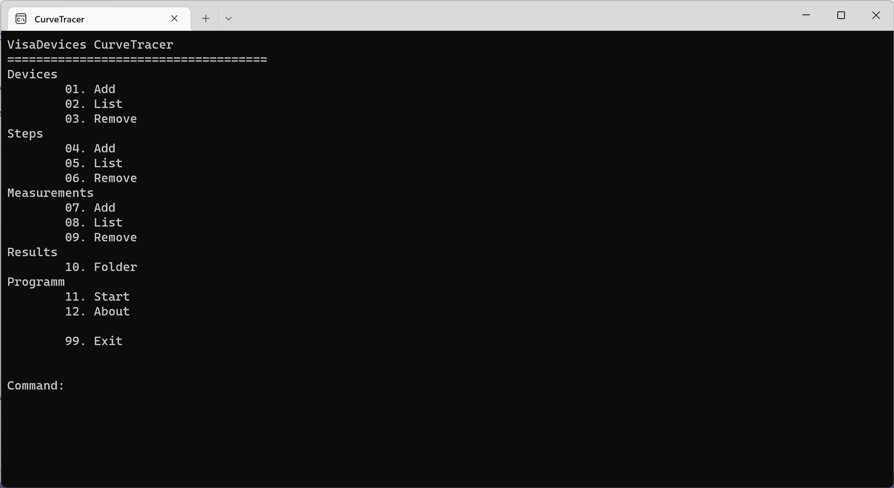

---
hide:
  - footer
---


# CurveTracer

The CurveTracer is a tool to sweep multiple parameters of lab devices and take measurements for each combination. It uses the VisaDevices library generic interfaces to connect to the devices.



## Usage

The tool uses a console-based user interface.

!!! bug "not complete"
    The tool is not complete!

The configuration for the devices, sweeps, measurements and the output folder have to be set. Typing the number of the action, will start the matching dialogue. 

!!! note "Note"
	The dialogs have no cancel option. If it is started parameters have to be set. They can be deleted afterwards.
	
When all configurations are set, the sweep can be started using the start action. The programm doesn't initialize the devices, only the parameters are updated! If it is nessesary to set other values before the programms starts,
it has to be manual.

## Devices

Devices can be used for sweeps or for measurements.

Parameter:

| Parameter | Description                                      |
| --------- | ------------------------------------------------ |
| Address   | Address of the device using the VISA library     |
| Device ID | ID of the driver to be used (see library manual) |
| Type      | Type of the device (see next table)              |

Device types:

| Type      | Description                                       |
|---------- |-------------------------------------------------- |
| 0         | Power supply                                      |
| 1         | Multimeter                                        |
| 2         | Electronic load                                   |
| 3         | Oscilloscope                                      |

!!! warning "Type"
	Using of the wrong type will lead to loading a different driver 

## Results

## Output files

The results of the measurements are stored in an array which is written to a csv file when all parameter sweeps are completed.
The counter of the sweep is used to identify the measurement. The values of the sweep itself are not saved!

```
Title Sweep 1; Title Sweep 2; Title Sweep 3; Measurement 1; Measurement 2
0;0;0;0;5.0;4.0
0;0;0;1;5.0;4.1
```

## Raw data
Some devices (like oscilloscopes, spectrum analyzers, ...) create a higher amount of data per measurement. In the normal output file there is only space for one value per sweep state.
The measurement will be written directly into an own file in the result folder. 

The name of the file will be selected in the following pattern: ID_S1_S2_S3_S4.txt
S representing the sweep index, ID the device id of the measurement device.

## Parameter sweep


| Parameter     | Description                               |
| ------------- | ----------------------------------------- |
| Device        | Index of the deivce in the device list    |
| Type          | Which parameter to be modified            |
| Channel       | Channel on the device                     |
| Delay         | waiting time after measurement            |
| Value Start   | Starting value                            |
| Value Stop    | Last Value                                |
| Value Inc     | Increment of the value at each step       |

The last sweep will be modified first. If it hast reached all values in the list, the next sweep (position left) will be increased. The values are double. The increasing can also be negative.

!!! note "Note"
    The values are not checked for errors:
    reaching values outside of the valid range for the device
    valid counting

!!! note "Note"
    Only linear sweeps are possible.

The sweep is connected to a device index. It represents the element in the device list.
Delay: value to wait after change. Necessary for some devices or circuit to stabilise.

!!! warning "Note"
    The device is not checked for an invalid index. Wrong values lead to a crash of the application.


# Measurements
All measurements are executed after a parameter has been modified (sweep). Channel and Mode of the device must be inserted.

!!! note "Note"
    If a device is used which created huge amounts of data, the result folder must have enough space for containing data for all variations.


| Parameter | Description                               |
| --------- | --------------------------------------    |
| Device    | Index of the deivce in the device list    |
| Type      | Which parameter to be measured            |
| Channel   | Channel on the device                     |
| Delay     | Waiting time after measurement            |

Types:

| Type      | Description                               |
| --------- | ----------------------------------------- |
| U         | Voltge                                    |
| I         | Current                                   |
| P         | Power                                     |
| W         | Waveform (oscilloscope  only)             |
| R         | Resistance                                |
| F         | Frequency                                 |
