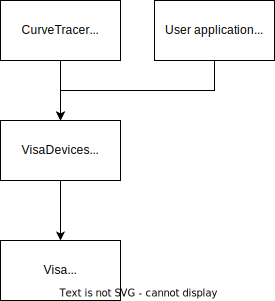

---
hide:
  - footer
---

# VisaDevices

VisaDevices is a library to control different lab instrument through the standardized VISA interface. It is written in C++ and designed as a shared library. To make the usage in different programming languages easier the interface is reduced to a standard C interface.

## Sourcecode

The source code of the library is avaiable under the GPLv3 license:

[https://github.com/flz5/visadevices](https://github.com/flz5/visadevices)

## Releases

Releases can be downloaded here:

[https://github.com/flz5/visa_devices/releases](https://github.com/flz5/visa_devices/releases)

