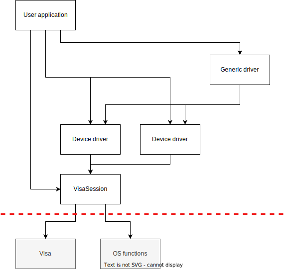

---
hide:
  - footer
---

# Architecture

The library is designed to offer two interface levels. The first interface is device specific.

The second interface implements an device independend architecture. the generic interface.

Informations about the state are stored in the VisaSession. 

The library used the Visa.dll and os funtions.

## VisaSession

## device driver

header files in the folder "inc/devices/"

### header files

### common implementation

## generic driver

The generic driver contains a array of function pointers to the specfic deive dependend implementation. Depending on the deivce id inside the handle the correct function is selected.
The interface is designed to match a wide range of devices, so no special functions are possible here.

### header files

| device type | folder |
|---|---|
| generic | generic.h|
| electronic load| generic_electronic_load.h |
| multimeter|generic_multimeter.h|
|oscilloscope|generic_oscilloscope.h|
|power supplies|generic_power_supply.h|
|signal generator|generic_signal_generator.h|

### id

32 bit integer

first 16bit: driver
last 16bit: device model

id unique only inside one device class

